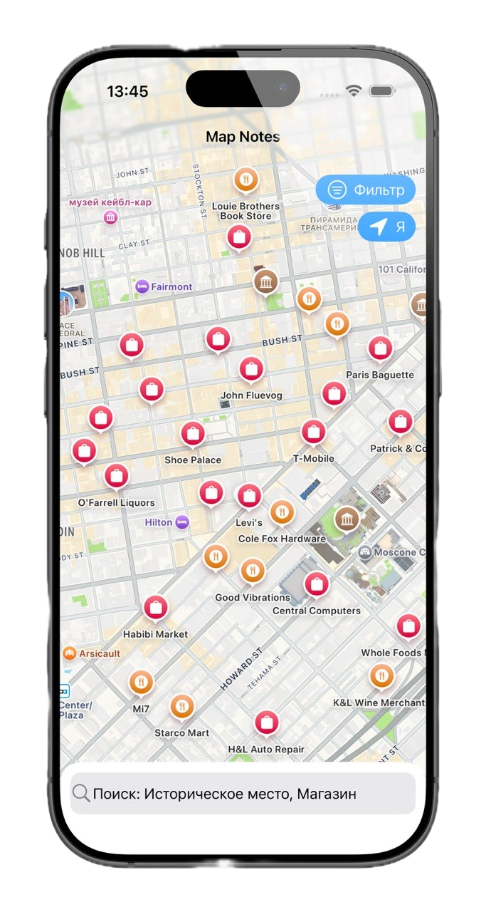
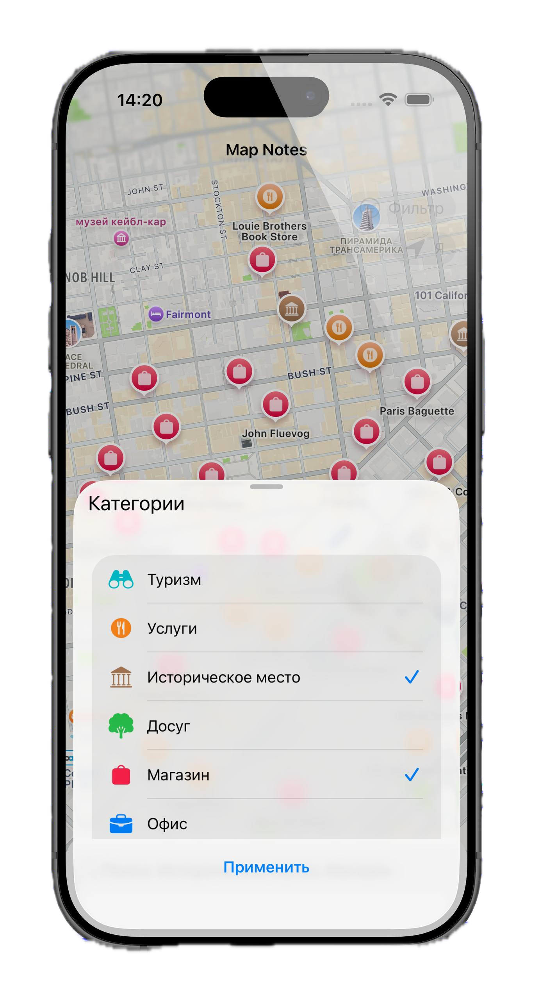
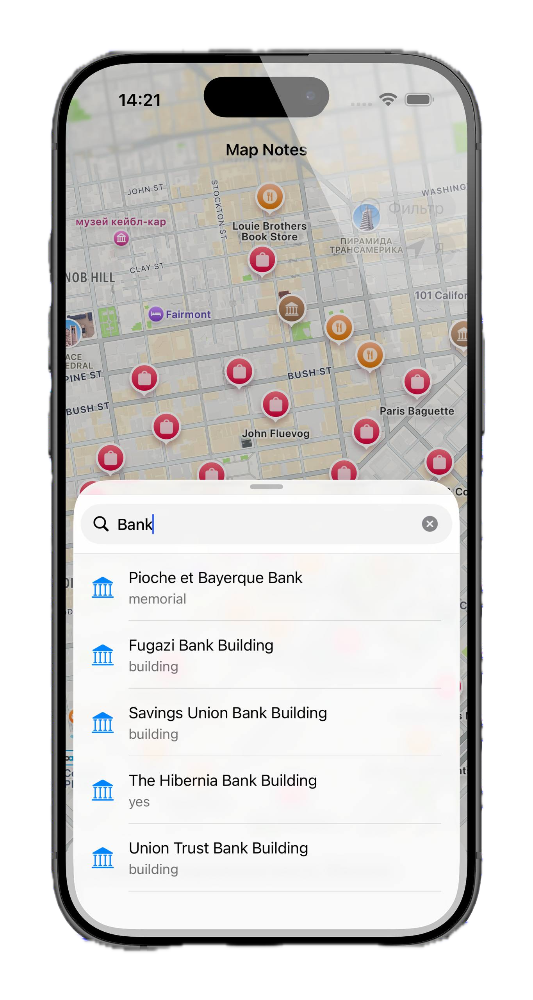
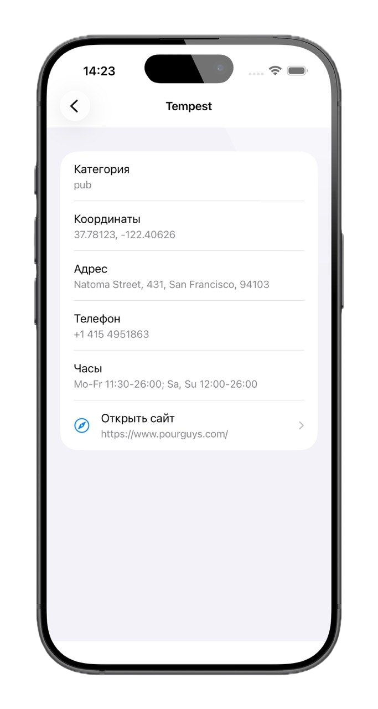

# MapNotes

Проект разработан специально для Школы мобильной разработки Яндекса.

iOS-приложение для просмотра на карте объектов: точки интереса подгружаются по видимой области через публичный API **Overpass**. Можно отфильтровать категории, искать места по названию и открывать карточку с контактами и описанием.

---

## Возможности

- **Карта** — `MapKit`, маркеры по категориям, данные из Overpass в пределах экрана.
- **Фильтр категорий** — выбор типов объектов (туризм, услуги, история, досуг, магазины и др.); запросы к API учитывают выбор.
- **Поиск по названию** — поиск по имени в текущих границах карты и выбранных категориях (debounce **1 секунда** с отменой предыдущего запроса).
- **Геолокация** — кнопка центрирования карты на положении пользователя (`CoreLocation`).
- **Карточка места** — название, подзаголовок по тегам, адрес, телефон, сайт, часы работы, описание, ссылка на Wikipedia; открытие сайта в Safari.

---

## Технологии

| Область | Стек |
|--------|------|
| Платформа | **Swift**, **UIKit** |
| Карта и координаты | **MapKit**, **CoreLocation** |
| Сеть | **Alamofire** (запросы к Overpass) |
| Вёрстка | **SnapKit** |
| Архитектура модулей | **View** + **Presenter** + **Router** + **Composer** (MVP) |
| Зависимости | CocoaPods (`Podfile`: Alamofire, SnapKit) |

Внешний сервис: [Overpass API](https://wiki.openstreetmap.org/wiki/Overpass_API) (формируются Overpass QL-запросы в `PlacesService`).

---

## Экраны

### 1. Главный экран — карта

Полноэкранная карта, пины объектов с иконками по категории. Сверху — навигационный заголовок. Снизу: кнопка **фильтра**, кнопка **центрирования на пользователе**, плашка-вход в **поиск**. При сдвиге/зуме карта перезапрашивает новые объекты.

---

### 2. Фильтр категорий (bottom sheet)

Открывается по кнопке фильтра. Список категорий с переключателями, кнопка применения. Выбранные категории влияют на загрузку точек и на поиск.

---

### 3. Поиск (bottom sheet)

Плашка поиска на карте открывает sheet с **UISearchBar** и таблицей результатов. Запрос уходит в Overpass по имени и текущим границам; при загрузке показывается индикатор. Выбор строки открывает карточку места.

---

### 4. Карточка места (push)

Экран деталей после тапа по пину или по результату поиска: **группированная таблица** с полями (адрес, телефон, часы и т.д.), описание, ячейка для открытия сайта.

---

## Сборка

1. Установить зависимости: `pod install` из корня репозитория.
2. Открыть **`MapNotes.xcworkspace`** в Xcode.

---

## Структура репозитория (кратко)

- `MapNotes/Modules/` — фичи: `Map`, `CategoryFilter`, `Search`, `PlaceDetail`
- `MapNotes/Services/` — сеть (`PlacesService`), геолокация (`LocationService`)
- `MapNotes/Models/` — модели (`Place`, `OverpassResponse`)
